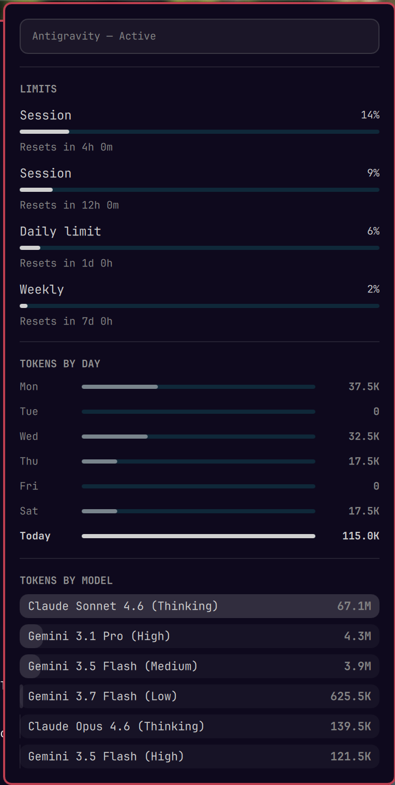

# anti-gravity-panel-omarchy

A lightweight, real-time Omarchy shell plugin that acts as a "super control" dashboard for the Google Antigravity Agent ecosystem.



## Features

- **Live Data Rendering**: Automatically updates the instant you interact with Antigravity, hooking directly into the `history.jsonl` stream via an embedded native QML Process.
- **Advanced Model Breakdown**: Dynamically parses both your `settings.json` and local conversation databases to accurately distribute your token usage across all the distinct models you switch between (e.g., Gemini Pro, Gemini Flash, Claude Sonnet).
- **Uncapped UI Height**: Specifically designed as a dashboard that stretches to fit all models without needing to scroll.

## How it works

Behind the scenes, this plugin uses a Python-based analytics collector (`collect-antigravity.py`) which merges token data from your historical SQLite database (`conversation_summaries.db`) with un-flushed live prompts from `history.jsonl`. 

The plugin's QML frontend embeds an `inotifywait` loop directly via a `Process` component. When a file change is detected in your Antigravity data directory, it triggers the python collector to generate a fresh payload, which the UI natively renders without delay. No background systemd services required!

## Installation

You can install this plugin directly from GitHub using the Omarchy CLI:

```bash
omarchy plugin add https://github.com/Pmacdon15/anti-gravity-panel-omarchy.git --enable
```

Once installed, you can bind it to a key combination (like `SUPER + 7`) in your `~/.config/hypr/bindings.lua`:
```lua
o.bind("SUPER + 7", "Antigravity", "omarchy-shell anti-gravity-panel-omarchy toggle")
```

## Management Commands

**Update the plugin:**
```bash
omarchy plugin update anti-gravity-panel-omarchy
```

**Disable the plugin (keeps files):**
```bash
omarchy plugin disable anti-gravity-panel-omarchy
```

**Uninstall the plugin entirely:**
```bash
omarchy plugin remove anti-gravity-panel-omarchy
```
